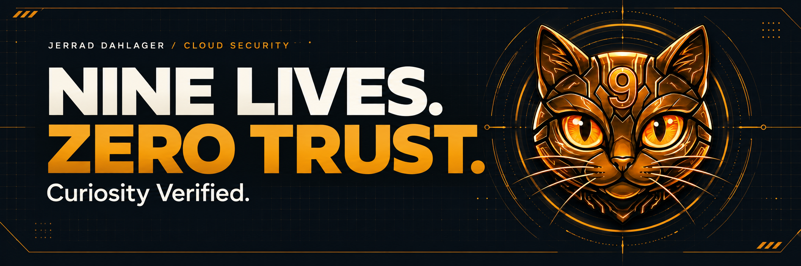

  <a href="https://nineliveszerotrust.com/blog/"><strong>READ THE BLOG</strong></a>
  &nbsp; / &nbsp;
  <a href="https://nineliveszerotrust.com/labs/"><strong>EXPLORE THE LABS</strong></a>
  &nbsp; / &nbsp;
  <a href="https://www.linkedin.com/in/jerraddahlager/"><strong>LET'S CONNECT</strong></a>

## Hey, I'm Jerrad.

**Cloud Security Architect · Adjunct Instructor · U.S. Marine Corps veteran**

I build and document practical cloud security: stronger identities, useful detections, and repeatable engineering. **[Nine Lives, Zero Trust](https://nineliveszerotrust.com/)** is where I share the designs, labs, and lessons along the way.

### What I work on

| Focus | Tools and techniques |
| :--- | :--- |
| **Identity & Zero Trust** | Entra ID · Conditional Access · phishing-resistant authentication |
| **Detection & response** | Microsoft Sentinel · Defender XDR · KQL · detection as code |
| **Cloud & DevSecOps** | Azure · AWS · Terraform · GitHub Actions · container security |

## Featured labs

<table>
  <tr>
    <td>
      01 / DETECTION ENGINEERING 
      <strong><a href="https://github.com/j-dahl7/gigawiper-detection-as-code">GigaWiper Detection as Code ↗</a></strong>
      
Behavior-based Defender XDR detections, Bicep, and safe telemetry validation.

    </td>
  </tr>
  <tr>
    <td>
      02 / IDENTITY SECURITY 
      <strong><a href="https://github.com/j-dahl7/entra-device-code-phishing-sentinel">Entra Device Code Phishing ↗</a></strong>
      
Sentinel analytics, Defender XDR hunts, and synthetic replay for device-code investigations.

    </td>
  </tr>
  <tr>
    <td>
      03 / SOFTWARE SUPPLY CHAIN 
      <strong><a href="https://github.com/j-dahl7/container-sbom-signing-attestation">Container Supply Chain ↗</a></strong>
      
Keyless image signing, signed SBOMs, and SLSA provenance with GitHub Actions.

    </td>
  </tr>
</table>

[Explore all labs →](https://nineliveszerotrust.com/labs/)

## Latest Blog Posts

The latest from Nine Lives, Zero Trust · Refreshed daily

<!-- BLOG-POST-LIST:START -->
**[Entra SSPR and Passkey Readiness for Microsoft-Provided SMS/Voice Delivery Retirement](https://nineliveszerotrust.com/blog/entra-sspr-september-2026-readiness/)** 
Aug 11, 2026

Microsoft is advancing three related parts of the Entra authentication and recovery experience between now and next March: On September 1, 2026…

**[GigaWiper Detection as Code: Testing the Sentinel Repositories Preview](https://nineliveszerotrust.com/blog/gigawiper-detections-as-code/)** 
Jul 13, 2026

Microsoft published its technical analysis of GigaWiper on July 9, 2026. Microsoft describes it as a modular backdoor with destructive capabilities…

**[From Authorization to Action: Operationalizing CISA&#39;s Microsoft Cloud Logs Playbook in Sentinel](https://nineliveszerotrust.com/blog/cisa-microsoft-cloud-logs-sentinel/)** 
May 10, 2026

CISA released the Microsoft Expanded Cloud Logs Implementation Playbook on January 15, 2025. Its implementation guidance remains a practical baseline…

**[Copy Fail in the Cloud: A Defender, Sentinel, and AKS Response Guide for CVE-2026-31431](https://nineliveszerotrust.com/blog/copy-fail-cve-2026-31431-microsoft-defender-sentinel-aks/)** 
May 2, 2026

A Linux local privilege escalation bug is easy to dismiss if you only think in traditional server terms. An attacker already needs local access, so…

**[Block Device Code Phishing in Entra Without Breaking Legit Workflows](https://nineliveszerotrust.com/blog/entra-device-code-phishing-sentinel/)** 
Apr 25, 2026

Device code phishing is nasty because the user does not hand over a password. They hand over a session. The lure sends the victim to a legitimate…
<!-- BLOG-POST-LIST:END -->

**[More field notes →](https://nineliveszerotrust.com/blog/)** &nbsp; · &nbsp; [Subscribe via RSS](https://nineliveszerotrust.com/index.xml)

## Certifications

  
  
  
  
  
  
  

## The contribution trail

  <picture>
    <source media="(prefers-color-scheme: dark)" srcset="https://raw.githubusercontent.com/j-dahl7/j-dahl7/output/github-snake-dark.svg" />
    <source media="(prefers-color-scheme: light)" srcset="https://raw.githubusercontent.com/j-dahl7/j-dahl7/output/github-snake.svg" />
    
  </picture>

---

  <strong>Stay curious. Keep building.</strong> 
  <a href="https://nineliveszerotrust.com/">nineliveszerotrust.com</a> · <a href="https://www.linkedin.com/in/jerraddahlager/">LinkedIn</a>

